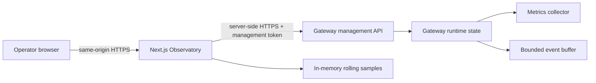

# Gateway Observatory plan

## Recommendation

Create **Gateway Observatory**, a separate, optional Next.js application at
`src/apps/observatory`. It complements the existing Dashboard rather than
duplicating it:

| Application | Purpose |
| --- | --- |
| Dashboard | Configure routes, validate changes, maintain configuration history, and restore revisions. |
| Gateway Observatory | Monitor the running gateway, identify failing routes, and inspect recent operational events. |

The first release supports one gateway instance. Multi-instance aggregation,
long-term storage, alert delivery, and log search are deferred until a clear
deployment requirement exists.

## User outcome

An operator can open one page and answer:

1. Is the gateway ready and reachable?
2. Which route is receiving traffic, failing, or slow?
3. Are circuit breakers open or rate limits being exceeded?
4. Did the active routing configuration recently change?
5. Is the information current, or has the gateway stopped reporting?

## Product scope

### Version 1

- Gateway overview with readiness, version, uptime, active-route count, and
  the timestamp of the latest successful route reload.
- Route table showing requests per second, total requests, 4xx/5xx percentage,
  average latency, cache-hit rate, and circuit state.
- Route details with a selectable 15-minute, 1-hour, or 6-hour window for
  requests, errors, and latency.
- Recent activity feed for route reloads, circuit state transitions, and
  rate-limit rejections.
- Filters for route, HTTP method, status class, and a failing-only view.
- Browser auto-refresh every 10 seconds, an explicit refresh action, and a
  visible data age indicator.
- Read-only access, protected end to end by a management token.

### Explicitly deferred

- Writing configuration or changing circuit state from Observatory.
- Request/response body capture, credentials, authorization headers, or
  client IP addresses.
- Multi-instance aggregation, durable time-series storage, alerts, tracing,
  and general log search.
- Replacing Prometheus, Grafana, or the existing configuration Dashboard.

## Architecture



The browser calls only Observatory's same-origin API. `GATEWAY_MANAGEMENT_TOKEN`
is kept in the Observatory server environment and never placed in JavaScript,
local storage, a query parameter, or rendered HTML.

The gateway exposes a compact structured snapshot instead of asking a browser
to parse `/metrics`. Prometheus scraping remains available through `/metrics`
and continues to be the integration point for external monitoring.

Observatory samples snapshots in its own memory to calculate rates and draw
short-window charts. On an Observatory restart, charts begin a fresh history;
the UI labels that condition. Counters remain authoritative in the gateway,
so a gateway restart is detected and shown instead of creating negative rates.

## Gateway work

### 1. Add management configuration and authorization

Add an `admin` configuration section and document these environment values:

| Variable | Default | Meaning |
| --- | --- | --- |
| `MANAGEMENT_ENABLED` | `false` | Enables the protected management routes. |
| `MANAGEMENT_TOKEN` | unset | Required token for management access. Startup fails when management is enabled without it. |
| `MANAGEMENT_PREFIX` | `/management` | Mount path for the management API. |

Use a constant-time token comparison. Accept `Authorization: Bearer <token>`
for server-to-server calls. Do not allow a permissive development bypass when
management routes are enabled.

### 2. Create an operation-state service

Add `GatewayOperationState` under `src/apps/api-gateway/operations` as a
process-local, read-only projection. It owns:

- gateway start time and build version;
- current readiness and active routes;
- last successful route reload;
- current circuit state by route and by upstream target where applicable;
- cumulative rate-limit rejection count by route;
- a bounded event buffer (1,000 events or 24 hours, whichever removes an
  event first).

Event payloads contain only timestamp, event type, route, safe status fields,
and an event id. They must never retain request bodies, tokens, cookies, client
addresses, or raw headers.

### 3. Connect existing lifecycle events

The existing `GatewayEventBus` already declares `route:reloaded`,
`circuitBreaker:stateChange`, and `rateLimit:exceeded`, but only route reloads
are currently emitted. Wire all circuit breakers created by
`CircuitBreakerMiddlewareFactory` into that bus, including target-specific
breakers. Update rate-limit middleware to emit an event only when a rejection
is returned.

Register one listener layer in `Server` that copies these events into
`GatewayOperationState`. Dispose listeners and old breaker subscriptions on
hot reload to prevent duplicate events and memory leaks.

### 4. Add a read-only management router

Mount it before the catch-all proxy routes and after request ID, logging,
helmet, and global CORS setup. Every endpoint sends `Cache-Control: no-store`.

| Endpoint | Response | Purpose |
| --- | --- | --- |
| `GET /management/v1/overview` | readiness, version, uptime, route summaries, circuit states, cumulative metric values, snapshot time | Main polling endpoint. |
| `GET /management/v1/routes/:baseURL/events?cursor=&limit=` | ordered activity events and next cursor | Paged route activity. |
| `GET /management/v1/events?cursor=&limit=` | ordered global activity events and next cursor | Overview feed. |
| `GET /management/v1/capabilities` | API version and enabled features | Safe compatibility check for Observatory. |

`overview` derives counters and histogram sum/count from
`MetricsCollector.registry.getMetricsAsJSON()`. It reports average latency in
version 1. Percentiles require either a deliberate bucket interpolation policy
or a dedicated rolling-latency collector, so they are excluded from the API
until that policy is agreed and tested.

Use a route identifier encoded as URL-safe base64 in path parameters instead
of accepting arbitrary `baseURL` text in a pathname. Validate cursor and limit,
cap `limit` at 100, and return a stable event id for de-duplication.

## Observatory application work

### Project layout

Create a workspace package consistent with `src/apps/dashboard`:

```text
src/apps/observatory/
  src/app/                         # Overview and route-detail pages
  src/app/api/gateway/              # Same-origin proxy to the management API
  src/modules/overview/             # Summary cards, route table, filters
  src/modules/routes/               # Detail panels and time-series views
  src/modules/events/               # Activity feed
  src/server/gateway/               # Typed management client and validation
  src/server/sampling/              # Bounded rolling sample store
  src/test/                         # Unit, component, and API contract tests
```

Add root scripts: `dev:observatory`, `build:observatory`,
`lint:observatory`, `test:observatory`, and include its build in `build:all`.
Use port `3002` by default. Environment values are:

```dotenv
GATEWAY_MANAGEMENT_URL=http://localhost:3000/management
GATEWAY_MANAGEMENT_TOKEN=
OBSERVATORY_POLL_INTERVAL_MS=10000
OBSERVATORY_SAMPLE_RETENTION_MS=21600000
```

Validate these values at server startup. Do not use client-exposed environment
variables for the URL or token.

### Screens

1. **Overview**: readiness banner, current data age, four key totals, and the
   filtered route table. Default sort puts open circuits and highest 5xx rate
   first, then active routes.
2. **Route detail**: route configuration summary read from the management
   overview, per-window charts, status breakdown, cache statistics, circuit
   state, and recent events.
3. **Activity**: paged, reverse-chronological events with filters and a
   persisted cursor for "load older".
4. **Connection settings**: server-configured endpoint identity, API version,
   last successful poll, and useful error states. It deliberately contains no
   token input because credentials stay on the server.

Use accessible semantic tables, keyboard-operable filters, text equivalents for
charts, and a non-color-only circuit status. Treat unavailable, stale, and
unauthorized as distinct states with clear recovery guidance.

## Delivery phases

| Phase | Work | Exit criteria |
| --- | --- | --- |
| 0. Contract | Finalize management endpoint JSON examples, API versioning, token behavior, and event retention. | Reviewed contract fixture exists. |
| 1. Runtime data | Implement configuration, authorization, operation state, event wiring, and management routes. | Gateway tests prove auth, current values, event ordering, reload cleanup, and no sensitive fields. |
| 2. Observatory foundation | Scaffold the app, typed server client, proxy API, polling, sampling, stale-state handling, and connection page. | Build and unit tests pass; token is absent from browser responses. |
| 3. Operator workflows | Build overview, route details, filters, charts, and activity feed. | A user can identify a failing route and its recent events from fixture data. |
| 4. Hardening | Add gateway/Observatory contract tests, accessibility checks, documentation, and local compose or walkthrough. | `build:all`, gateway tests, Observatory tests, and an end-to-end smoke test pass. |

## Test plan

- Gateway unit tests for authorization, disabled management routes, invalid
  query parameters, and overview metric mapping.
- Integration tests that generate success, 5xx, cache-hit, circuit-open, and
  rate-limit-rejection scenarios, then assert the management snapshot and
  event feed.
- Hot-reload tests confirming a replaced route no longer produces duplicate
  circuit or rate-limit events.
- Observatory unit tests for counter reset, missing route data, stale data,
  event cursor de-duplication, and time-window aggregation.
- Component tests for filters, keyboard navigation, accessible status text,
  empty state, unavailable gateway, and unauthorized gateway.
- A smoke test runs the gateway and Observatory with a known token, validates
  that the browser-facing API returns data, and confirms the token is not in
  the response body or static HTML.

## Success measures

- An overview becomes usable within 15 seconds of starting both applications.
- A gateway state change appears in the UI within two polling intervals.
- Route table totals match `/metrics` counters for the same gateway process.
- Management endpoints reject all missing or invalid credentials.
- No operational event stores sensitive request data.

## Decisions needed before implementation

1. Is the first deployment strictly one gateway instance, as recommended, or
   must the first release aggregate multiple instances?
2. Should the management API share the public listener or use a separate
   private listener/port in production?
3. Which deployment target will host the optional Next.js application
   (container, VM process, or another platform)?

